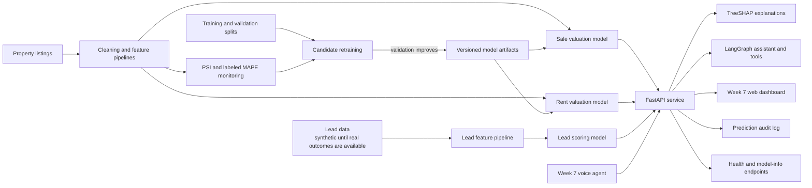

# System architecture

The API is the shared serving boundary for the Week 7 web and voice clients, valuation and lead models, explanations, and assistant tools. Model candidates are evaluated on validation data before promotion; the locked test split is reserved for final evaluation. The configured Docker image packages the FastAPI service and model/data artifacts.

The Week 7 dashboard currently displays simulated Week 8 leads with an explicit source label. The lead model must not be treated as production-validated until it has been calibrated against quality-checked CRM outcomes.
